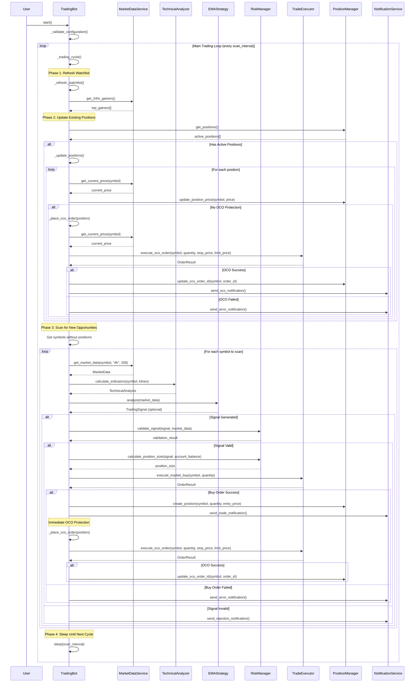
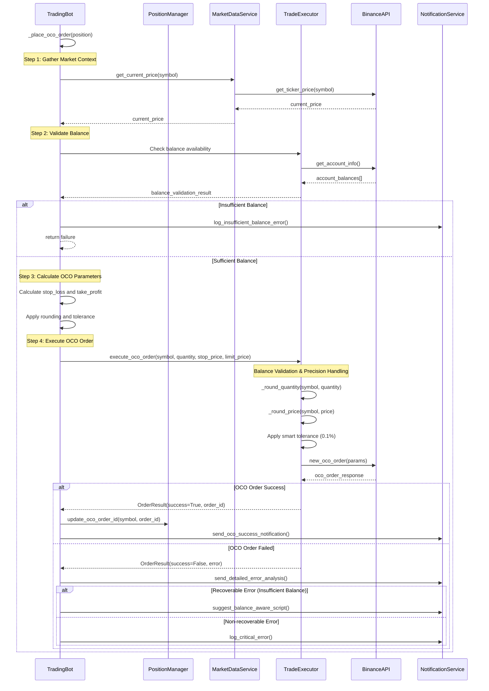
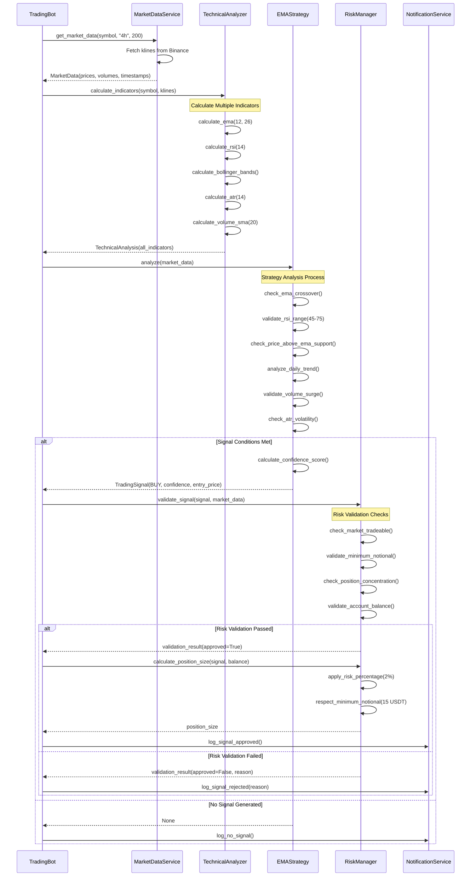
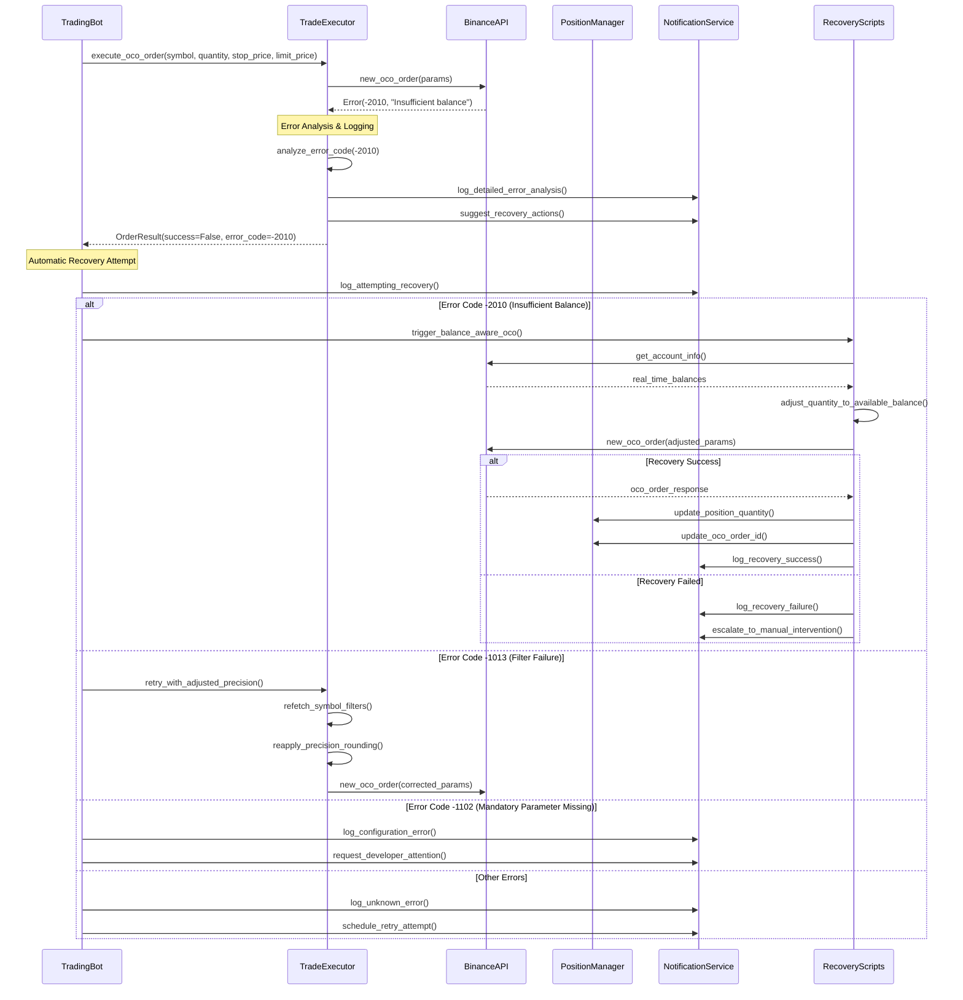

# Trading Bot Workflow - Sequence Diagram

This document contains sequence diagrams explaining the complete workflow of the AI Trading Bot system.

## Main Trading Cycle Flow

## OCO Order Creation Workflow

## Signal Generation and Validation Workflow

## Error Handling and Recovery Workflow

## System Architecture Overview

```mermaid
graph TB
    subgraph "User Interface Layer"
        CLI[Command Line Interface]
        Scripts[Management Scripts]
    end

    subgraph "Core Trading Bot"
        TB[TradingBot Main]
        Config[TradingConfig]
    end

    subgraph "Strategy Layer"
        BaseStrat[BaseStrategy]
        EMAStrat[EMACrossStrategy]
        CustomStrat[Custom Strategies]
    end

    subgraph "Service Layer"
        MDS[MarketDataService]
        TES[TradeExecutionService]
        RMS[RiskManagementService]
        PMS[PositionManagementService]
        TAS[TechnicalAnalysisService]
        NS[NotificationService]
    end

    subgraph "Core Interfaces"
        IStrat[IStrategy]
        IMDP[IMarketDataProvider]
        ITE[ITradeExecutor]
        IRM[IRiskManager]
        IPM[IPositionManager]
        INS[INotificationService]
        ITA[ITechnicalAnalyzer]
    end

    subgraph "Data Layer"
        ActiveTrades[active_trades.txt]
        Logs[logs/output.log]
        ConfigFile[config/.env]
    end

    subgraph "External APIs"
        BinanceAPI[Binance API]
        MarketData[Market Data Feed]
    end

    CLI --> TB
    Scripts --> TB
    TB --> Config

    TB --> BaseStrat
    BaseStrat --> EMAStrat
    BaseStrat --> CustomStrat

    TB --> MDS
    TB --> TES
    TB --> RMS
    TB --> PMS
    TB --> TAS
    TB --> NS

    MDS -.implements.-> IMDP
    TES -.implements.-> ITE
    RMS -.implements.-> IRM
    PMS -.implements.-> IPM
    TAS -.implements.-> ITA
    NS -.implements.-> INS

    EMAStrat -.implements.-> IStrat
    CustomStrat -.implements.-> IStrat

    PMS --> ActiveTrades
    NS --> Logs
    Config --> ConfigFile

    MDS --> BinanceAPI
    TES --> BinanceAPI
    MDS --> MarketData

    classDef interface fill:#e1f5fe
    classDef service fill:#f3e5f5
    classDef strategy fill:#e8f5e8
    classDef data fill:#fff3e0
    classDef external fill:#ffebee

    class IStrat,IMDP,ITE,IRM,IPM,INS,ITA interface
    class MDS,TES,RMS,PMS,TAS,NS service
    class BaseStrat,EMAStrat,CustomStrat strategy
    class ActiveTrades,Logs,ConfigFile data
    class BinanceAPI,MarketData external
```

## Key Components Description

### 1. TradingBot (Main Orchestrator)

- **Responsibility**: Coordinates all trading activities
- **Key Methods**: `start()`, `_trading_cycle()`, `_update_positions()`, `_place_oco_order()`
- **Dependencies**: All service interfaces via dependency injection

### 2. Strategy Layer

- **EMAStrategy**: Implements EMA crossover with advanced filters
- **BaseStrategy**: Abstract base class for all strategies
- **Signal Generation**: Analyzes market data and generates trading signals

### 3. Service Layer

- **MarketDataService**: Fetches real-time market data from Binance
- **TradeExecutionService**: Executes buy/sell/OCO orders with precision handling
- **RiskManagementService**: Validates signals and calculates position sizes
- **PositionManagementService**: Manages active positions and persistence
- **TechnicalAnalysisService**: Calculates technical indicators
- **NotificationService**: Handles logging and error notifications

### 4. Error Handling & Recovery

- **Smart Balance Validation**: 0.1% tolerance for floating-point precision
- **Automatic OCO Retry**: Balance-aware scripts for recovery
- **Detailed Error Analysis**: Specific handling for different Binance error codes
- **Progressive Recovery**: Multiple fallback strategies for failed operations

### 5. Data Flow

1. **Market Scanning**: Refresh watchlist → Scan symbols → Generate signals
2. **Signal Validation**: Risk checks → Position sizing → Trade execution
3. **Position Management**: Real-time updates → OCO protection → Profit/loss tracking
4. **Error Recovery**: Failed operations → Analysis → Automatic retry → Manual escalation

This architecture follows SOLID principles with clear separation of concerns, dependency injection, and comprehensive error handling for robust trading operations.
